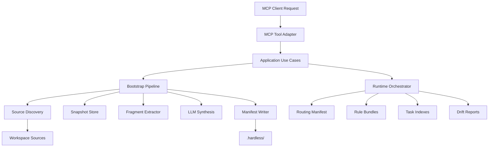
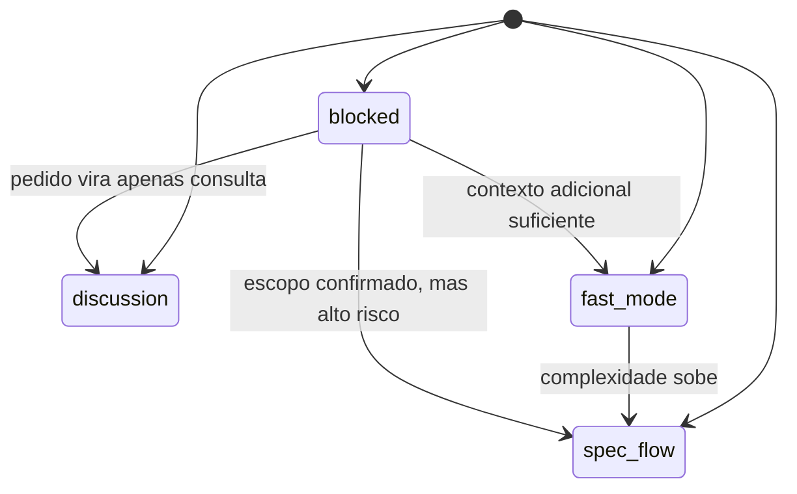

# Design - Hardless MCP Alpha

## Overview

O alpha do `Hardless MCP` sera desenhado como um servidor MCP local workflow-first com bootstrap repo-native, runtime orientado por artefatos curados em `.hardless/` e uma camada de instalacao gerenciada para dar precedencia ao Hardless em superficies de memoria suportadas. O sistema nao tratara arquivos como `AGENTS.md` ou `.cursorrules` como contrato direto de runtime; eles entram como fontes de ingestao para uma pipeline controlada, com snapshots, fragmentacao, sintese assistida e manifestos de proveniencia, confianca e drift.

A abordagem escolhida privilegia um bootstrap hibrido e auditavel antes de qualquer roteamento de tarefa. Isso atende melhor aos requisitos porque reduz improviso operacional, impede dependencia excessiva de contexto cru e permite que `discussion`, `fast_mode`, `spec_flow` e `blocked` nascam de um contrato estavel do Hardless, nao de leitura ad hoc do workspace a cada solicitacao.

Este design cobre o alpha do pacote `packages/hardless-mcp`, a estrutura inicial de `.hardless/`, a pipeline ponta a ponta de bootstrap e refresh, os principais schemas/manifests operacionais, as tools MCP iniciais, a instalacao gerenciada em superficies suportadas e a arquitetura interna do pacote. Ele nao detalha UI propria, sync cloud, multiworkspace ou enforcement absoluto sobre clientes nao suportados.

## Goals

- Definir uma estrutura concreta e pequena para `.hardless/` que suporte bootstrap, triagem, roteamento e drift.
- Especificar uma pipeline de bootstrap hibrida com etapas deterministicas e pontos limitados de sintese assistida.
- Formalizar schemas/manifests suficientes para manter proveniencia, confianca e estado operacional rastreaveis.
- Desenhar a estrategia de ingestao para fontes heterogeneas sem transformar arquivos crus em contrato de runtime.
- Delimitar as tools MCP do alpha em torno de bootstrap, triagem, contexto e guardrails.
- Organizar `packages/hardless-mcp` de modo que o alpha seja implementavel rapidamente sem criar acoplamento estrutural prematuro.
- Preservar produtividade sem permissividade: seguir rapido quando houver confianca suficiente e bloquear cedo quando a incerteza relevante ameaçar a qualidade do fluxo.
- Isolar o SDK MCP escolhido atras de um adapter interno para permitir troca futura sem contaminar o runtime.

## Non-Goals

- Criar uma interface desktop ou extensao de editor no alpha.
- Resolver indexacao semantica profunda de codigo inteiro do workspace.
- Suportar mais de um workspace ativo por sessao.
- Garantir obediencia absoluta de qualquer cliente MCP ao workflow do Hardless.
- Projetar desde ja uma arquitetura de marketplace, cloud sync ou multiusuario.
- Otimizar o alpha para uma matriz ampla de clientes MCP desde o primeiro ciclo de validacao.

## Architecture

O alpha sera composto por quatro camadas principais dentro de `packages/hardless-mcp`:

1. `application`: orquestra casos de uso como `bootstrapWorkspace`, `refreshSources`, `triageTask` e `loadContextBundle`.
2. `domain`: concentra modelos, enums, regras de classificacao, politicas de gate e contratos de manifestos.
3. `infra`: implementa filesystem, hashing, snapshots, leitura de markdown/configs, heuristicas de fragmentacao e adapter MCP.
4. `runtime`: monta o estado operacional do workspace com base nos artefatos em `.hardless/` e expoe pacotes minimos de contexto para cada fluxo.



## Data Flow

### 1. Bootstrap inicial

1. O operador chama a tool de bootstrap para o workspace atual.
2. O sistema valida raiz, permissao local e ausencia de conflito estrutural invalido.
3. O `source discovery` encontra fontes suportadas por padrao e registra ausencias sem preencher lacunas.
4. O `snapshot store` persiste copias ou referencias estaveis das fontes em `.hardless/sources/`.
5. O `fragment extractor` quebra as fontes em unidades menores usando delimitadores deterministas.
6. O `classifier` aplica taxonomia inicial e marca ambiguidades.
7. O `synthesis stage` gera artefatos curados apenas onde houver schema claro e limite de escopo.
8. O `confidence evaluator` calcula a confianca agregada do pacote curado e decide se a ativacao pode ser automatica.
9. O `manifest writer` grava manifestos operacionais, indices, bundles e relatorios.
10. Se a confianca agregada atingir o limiar do alpha, o runtime marca o workspace como `ready`.
11. Se a confianca agregada ficar abaixo do limiar, o runtime marca o pacote como `pending_activation` e exige confirmacao explicita do operador.

### 1.5 Instalacao gerenciada

1. O operador chama `hardless.install` apos bootstrap valido.
2. O sistema detecta `AGENTS.md` e `.cursorrules`.
3. O sistema cria backup das superficies existentes em `.hardless/backups/`.
4. O sistema injeta um bloco Hardless gerenciado no topo de cada superficie suportada.
5. O conteudo original do usuario permanece abaixo do bloco gerenciado.
6. O sistema grava `installation.json` com versao do template, backups e estado das superficies.
7. `hardless.uninstall` restaura as superficies originais.
8. `hardless.repair` recompõe o bloco gerenciado sem apagar o conteudo do usuario abaixo dele.

### 2. Triage de solicitacao

1. O cliente envia uma solicitacao textual para triagem.
2. O runtime classifica o pedido em `discussion`, `fast_mode`, `spec_flow` ou `blocked`.
3. O runtime escolhe um tipo primario e, se necessario, um subcenario.
4. O `context loader` consulta `routing/triage-policy.json`, `routing/escalation-policy.json` e `indexes/task-types/`.
5. O runtime aplica politica conservadora: incerteza relevante em classificacao, impacto, contradicao ou validacao empurra o fluxo para `blocked` ou `spec_flow`.
6. O pacote minimo de contexto e retornado com justificativa, fontes carregadas, stale flags e proximos gates.
7. Em `fast_mode`, o runtime tambem retorna um plano curto de execucao e o proximo passo operacional recomendado.
8. Se a tarefa exigir escrita, o runtime exige que a classificacao esteja valida e que exista caminho de validacao.

### 3. Refresh e reconciliacao

1. O operador chama refresh explicito ou o runtime detecta drift numa leitura relevante.
2. O sistema recomputa hashes das fontes registradas.
3. Fontes alteradas geram impacto em fragmentos e artefatos dependentes.
4. O refresh atualiza apenas os trechos necessarios quando possivel.
5. Se a confianca cair ou a contradicao subir, o runtime marca o estado como `stale_with_warning` e pode exigir reconciliacao assistida.

## Components And Responsibilities

### `WorkspaceRegistry`

- Responsabilidade: validar e registrar o workspace ativo por sessao.
- Entradas: caminho alvo e opcoes de bootstrap/runtime.
- Saidas: `WorkspaceContext` com paths absolutos, estado e locks.
- Dependencias: filesystem e validadores de root.
- Restricoes: apenas um workspace ativo por processo de runtime.

### `SourceDiscoveryService`

- Responsabilidade: localizar fontes conhecidas do usuario e classifica-las por tipo.
- Entradas: raiz do workspace e mapa de discovery.
- Saidas: lista de `DiscoveredSource`.
- Dependencias: walkers de filesystem e mapa de suportes.
- Restricoes: discovery deterministico; nenhuma geracao de conteudo aqui.

### `SnapshotStore`

- Responsabilidade: persistir snapshot ou ponteiro estavel das fontes e registrar hash.
- Entradas: fontes descobertas.
- Saidas: `SourceSnapshotRecord`.
- Dependencias: hashing e IO local.
- Restricoes: nunca perder ligacao entre snapshot e fonte original.

### `FragmentExtractor`

- Responsabilidade: transformar fontes extensas em fragmentos menores.
- Entradas: snapshot textual estruturado.
- Saidas: lista de `SourceFragment`.
- Dependencias: parser de markdown simples, heuristicas de listas, headings e blocos.
- Restricoes: extracao objetiva antes de qualquer sintese livre.

### `FragmentClassifier`

- Responsabilidade: associar fragmentos a temas operacionais e task types.
- Entradas: `SourceFragment`.
- Saidas: `ClassifiedFragment`.
- Dependencias: heuristicas e fase opcional de classificacao assistida.
- Restricoes: obrigatorio expor ambiguidade e `confidence`.

### `ArtifactSynthesizer`

- Responsabilidade: gerar artefatos operacionais curados do Hardless.
- Entradas: fragmentos classificados, metodo do produto e schemas dos manifestos.
- Saidas: rule bundles, indexes, routing manifest, validation packs e reports.
- Dependencias: serializadores JSON/YAML e provider LLM opcional.
- Restricoes: toda sintese deve declarar origem dominante, fallback aplicado e limites.

### `ConfidenceEvaluator`

- Responsabilidade: calcular a confianca agregada do bootstrap e decidir se os artefatos podem ser ativados sem intervencao humana.
- Entradas: fragmentos classificados, sinais de contradicao, fallbacks aplicados e cobertura dos bundles obrigatorios.
- Saidas: `ActivationDecision` com score agregado, limiar, razoes e necessidade de confirmacao.
- Dependencias: manifestos, heuristicas de risco e politicas do alpha.
- Restricoes: baixa confianca nunca pode ser escondida por ativacao silenciosa.

### `RuntimeOrchestrator`

- Responsabilidade: aplicar triagem, gates, carregamento minimo e promocao de fluxo.
- Entradas: pedido do cliente, estado do workspace e artefatos em `.hardless/`.
- Saidas: `TriageResult`, `ContextBundle`, bloqueios e recomendacoes de proximo passo.
- Dependencias: manifestos operacionais.
- Restricoes: nao pode iniciar escrita sem classificacao valida e pacote minimo carregado.

### `DriftMonitor`

- Responsabilidade: detectar divergencia entre fontes e artefatos derivados.
- Entradas: source manifest, hashes atuais e relacoes de dependencia.
- Saidas: `DriftReport`.
- Dependencias: hashing, leitura de manifestos e reindexacao incremental.
- Restricoes: marcar degradacao explicitamente, sem tentar esconder stale state.

### `McpToolAdapter`

- Responsabilidade: expor tools do alpha em contrato MCP.
- Entradas: requests do cliente MCP.
- Saidas: respostas estruturadas para bootstrap, triagem, contexto e status.
- Dependencias: SDK MCP escolhido no alpha.
- Restricoes: tools devem refletir workflow e guardrails, nao apenas acesso a arquivo; detalhes do SDK nao podem vazar para `application` nem `runtime`; o primeiro ciclo de validacao deve priorizar comportamento correto no `Cursor`; `content.text` precisa continuar observavel mesmo quando o cliente MCP nao expuser `structuredContent`.

## Interfaces And Contracts

### Estrutura de `.hardless/`

```text
.hardless/
  manifests/
    workspace.json
    sources.json
    fragments.json
    routing.json
    provenance.json
  sources/
    snapshots/
    raw-index/
  fragments/
    by-source/
    by-topic/
  rules/
    required/
    triggered/
    fallback/
  indexes/
    task-types/
    references/
  routing/
    triage-policy.json
    escalation-policy.json
  memory/
    workspace-memory.md
  reports/
    drift.json
    bootstrap-summary.md
  backups/
    AGENTS.md.original
    .cursorrules.original
```

### Motivacao da estrutura

- `manifests/` concentra contratos estruturais e versoes do runtime.
- `sources/` preserva origem rastreavel e snapshots.
- `fragments/` separa o material intermediario de extração/classificacao.
- `rules/` contem bundles prontos para carregamento minimo.
- `indexes/` acelera lookup por tipo primario e referencias sob gatilho.
- `routing/` centraliza politica operacional do alpha.
- `memory/` guarda memoria curta do workspace, separada das fontes do usuario.
- `reports/` expõe saude operacional e drift.
- `backups/` preserva as superficies originais tocadas pela instalacao gerenciada.
- Manifestos, bundles e indexes usados pelo runtime devem ficar em `JSON`; relatorios voltados a leitura humana podem ficar em `Markdown`.

### Schema conceitual de `workspace.json`

```json
{
  "schemaVersion": "1",
  "workspaceRoot": "/abs/path",
  "workspaceId": "hardless-hash",
  "bootstrappedAt": "2026-04-19T12:00:00Z",
  "methodVersion": "alpha-1",
  "status": "ready",
  "activationStatus": "auto_activated",
  "confidenceScore": 0.84,
  "activationThreshold": 0.75,
  "activeRuntimeMode": "workflow_first"
}
```

### Schema conceitual de `sources.json`

```json
{
  "schemaVersion": "1",
  "sources": [
    {
      "sourceId": "src_agents_md",
      "sourcePath": "AGENTS.md",
      "sourceType": "agents_md",
      "discoveryMode": "deterministic",
      "snapshotPath": ".hardless/sources/snapshots/src_agents_md.md",
      "hash": "sha256:...",
      "ingestionStatus": "ingested",
      "lastSeenAt": "2026-04-19T12:00:00Z"
    }
  ]
}
```

### Schema conceitual de `fragments.json`

```json
{
  "schemaVersion": "1",
  "fragments": [
    {
      "fragmentId": "frag_workflow_001",
      "sourceId": "src_agents_md",
      "sourcePath": "AGENTS.md",
      "topic": "workflow",
      "taskTypes": ["feature", "refactoring"],
      "excerptLocator": {
        "heading": "Workflow",
        "lineStart": 10,
        "lineEnd": 34
      },
      "confidence": 0.88,
      "ambiguity": "low",
      "derivedFrom": "deterministic_fragmentation",
      "extractedAt": "2026-04-19T12:00:00Z"
    }
  ]
}
```

### Schema conceitual de `routing.json`

```json
{
  "schemaVersion": "1",
  "triageStates": ["discussion", "fast_mode", "spec_flow", "blocked"],
  "taskTypeIndexes": {
    "feature": "indexes/task-types/feature.json",
    "diagnostic": "indexes/task-types/diagnostic.json"
  },
  "escalationRules": [
    "multi_area_change",
    "contract_change",
    "high_ambiguity",
    "contradictory_sources",
    "missing_validation"
  ],
  "blockingPolicy": {
    "mode": "conservative",
    "blockOnRelevantUncertainty": true
  },
  "fallbackPolicy": {
    "allowHardlessDefaults": true,
    "requireDisclosure": true
  }
}
```

### Schema conceitual de `provenance.json`

```json
{
  "schemaVersion": "1",
  "artifacts": [
    {
      "artifactPath": ".hardless/rules/required/feature.json",
      "artifactType": "required_rule_bundle",
      "dominantInputs": ["src_agents_md", "method/workflow-canon.md"],
      "confidence": 0.81,
      "fallbackApplied": ["hardless_default_validation_gate"],
      "driftStatus": "fresh"
    }
  ]
}
```

### Contrato de `TriageResult`

```ts
type TriageState = 'discussion' | 'fast_mode' | 'spec_flow' | 'blocked';

interface TriageResult {
  state: TriageState;
  taskType: string;
  subScenario?: string;
  rationale: string;
  uncertaintyLevel: 'low' | 'moderate' | 'high';
  requiredArtifacts: string[];
  triggeredReferences: string[];
  staleWarnings: string[];
  canWrite: boolean;
  shortPlan?: string[];
  suggestedNextStep: 'reply_only' | 'execute_fast_mode' | 'prepare_spec' | 'request_context';
}
```

### Orcamento de contexto do alpha

- `discussion`: metodo do Hardless + no maximo 1 bundle required + 1 referencia sob gatilho.
- `fast_mode`: metodo do Hardless + bundle do tipo primario + no maximo 1 subindice + 2 referencias sob gatilho + plano curto.
- `spec_flow`: metodo do Hardless + bundles do tipo primario + artefatos `.specs/` relevantes + referencias necessarias por risco.
- `blocked`: retornar apenas diagnostico de lacuna, bundle minimo de justificativa e criterio de desbloqueio.

## States And Transitions

### Estados do workspace

| Estado | Significado | Transicoes permitidas |
|---|---|---|
| `uninitialized` | `.hardless/` inexistente ou incompleto | `bootstrapping`, `error` |
| `bootstrapping` | pipeline ativa de initialize/refresh total | `ready`, `degraded`, `error` |
| `pending_activation` | artefatos gerados, mas abaixo do limiar de ativacao automatica | `ready`, `degraded`, `disabled` |
| `ready` | artefatos principais validos e fresh | `refreshing`, `degraded`, `disabled` |
| `refreshing` | reconciliacao parcial ou total em curso | `ready`, `degraded`, `error` |
| `degraded` | runtime com drift, baixa confianca ou falta de artefato | `refreshing`, `disabled`, `error` |
| `disabled` | operador optou por pausar o Hardless | `ready` |
| `error` | falha impeditiva | `bootstrapping`, `refreshing` |

### Estados da triagem



## Error Handling

- Workspace invalido: retornar erro estruturado e nao criar `.hardless/`.
- Fonte ausente: registrar no source manifest como `missing`; nunca inventar conteudo.
- Fonte ilegivel: marcar `ingestionStatus=failed` com causa.
- Fragmentacao ambigua: produzir fragmento com `ambiguity=high` e impedir uso silencioso como regra obrigatoria.
- Sintese LLM indisponivel: degradar para artefatos parciais deterministas e registrar fallback.
- Confianca abaixo do limiar: gerar artefatos, marcar `pending_activation` e exigir confirmacao explicita antes de promover o pacote ao runtime primario.
- Drift detectado em artefato critico: permitir leitura com warning, mas bloquear escrita se a politica assim exigir.
- Contradicao entre fontes: elevar risco, registrar no report e preferir `blocked` ou `spec_flow`.
- Incerteza relevante na triagem: preferir bloqueio ou escalacao para `spec_flow`, nunca execucao otimista silenciosa.

## Security And Permissions

- O alpha opera apenas no workspace local explicitamente selecionado.
- Escrita em `.hardless/` depende de bootstrap/refresh aprovados pelo operador.
- O runtime deve distinguir leitura segura de operacoes de escrita ou reconciliacao.
- Nenhum segredo deve ser extraido para manifestos curados sem necessidade funcional explicita.
- Snapshots devem evitar replicar arquivos irrelevantes ou volumosos fora do mapa de fontes suportadas.

## Observability And Operations

- `bootstrap-summary.md` deve resumir fontes encontradas, fontes ausentes, fragmentos gerados, fallbacks aplicados, score de confianca e decisao de ativacao.
- `drift.json` deve listar fontes alteradas, artefatos potencialmente stale e recomendacao de refresh.
- Logs estruturados do alpha devem registrar: inicio/fim de bootstrap, triage state, escalacoes, bloqueios e erros de ingestao.
- O runtime deve expor status simples do workspace: `ready`, `degraded`, `disabled` ou `error`.
- O runtime deve expor tambem `pending_activation` quando o bootstrap estiver pronto, mas ainda nao puder virar contrato primario sem confirmacao.
- O operador deve conseguir pausar o Hardless sem remover `.hardless/`.

## Impact Analysis

| Superficie | Evidencia | Tipo de impacto | Consequencia provavel | Acao necessaria |
|---|---|---|---|---|
| `.specs/features/hardless-mcp/requirements.md` | requisito 11 atualizado para repo proprio | alinhamento de contrato | previne implementacao num shape obsoleto | manter rastreio com tasks |
| `.specs/features/hardless-mcp/decisions.md` | D-001 superseded, D-006 accepted | alinhamento arquitetural | reduz contradicao entre spec e produto | sincronizar se novas decisoes surgirem |
| `method/` | docs definem taxonomia, gates e ingestion map | dependencia de design | metodo vira fonte estavel do produto | usar como input da sintese, nao copiar cru |
| `packages/hardless-mcp/` | scaffold minimo existente | implementacao direta | precisa receber estrutura real de runtime | executar foundation tasks primeiro |
| `.hardless/` no workspace do usuario | novo contrato operacional | impacto externo | muda como runtime acessa regras e contexto | projetar manifests pequenos e auditaveis |
| `hardless.triage` e `hardless.context` | ponto principal de produtividade do alpha | impacto de produto | define se o MCP acelera ou so documenta | garantir plano curto e proximo passo em `fast_mode` |

## Alternatives Considered

### 1. Ler `AGENTS.md` e similares diretamente em runtime

Ruim para este produto. Isso barateia a implementacao inicial, mas derruba a proposta workflow-first, aumenta custo de contexto e torna a qualidade do runtime dependente da qualidade dos arquivos crus do usuario.

### 2. Fazer bootstrap quase inteiro por LLM

Tambem e uma decisao ruim. Aceleraria a primeira versao, mas sacrificaria auditabilidade, proveniencia e capacidade de refresh incremental sem alucinacao.

### 3. Modelar tudo como um unico manifesto gigante

Foi descartado porque criaria um artefato central demais, caro para diff, fragil para refresh parcial e ruim para carregamento minimo por tipo de tarefa.

### 4. Espalhar a implementacao em varios pacotes desde o dia zero

Descartado no alpha. Embora a separacao futura seja desejavel, antecipar microarquitetura agora aumentaria friccao sem entregar valor real enquanto o runtime ainda esta sendo validado.

## Validation Strategy

- Validar a estrutura de `.hardless/` por testes de filesystem e fixtures de bootstrap.
- Validar `source discovery` e `snapshot store` com workspaces de exemplo contendo combinacoes de fontes presentes, ausentes e contraditorias.
- Validar fragmentacao deterministica com fixtures de markdown grandes e semiestruturados.
- Validar o `ConfidenceEvaluator` com cenarios acima e abaixo do limiar de ativacao.
- Validar triagem por testes de tabela cobrindo `discussion`, `fast_mode`, `spec_flow` e `blocked`.
- Validar que `fast_mode` retorna plano curto e proximo passo operacional, nao apenas classificacao.
- Validar promocao de `fast_mode` para `spec_flow` com cenarios que introduzem risco ou ambiguidade durante a execucao.
- Validar drift detection alterando hashes de fontes e verificando propagacao para `drift.json` e `provenance.json`.
- Validar manualmente o slice alpha no `Cursor`, usando um workspace real que possua `AGENTS.md`, `.specs/` e docs arquiteturais.

## Design Gate

- Status: `APPROVED`
- Alinhado com `requirements.md`? `sim`
- Decisoes pendentes: `0`
- Pode seguir para `tasks.md`? `sim`

## Notes

- O alpha deve preferir artefatos pequenos e composicionais a documentos monoliticos.
- A primeira implementacao deve errar por explicitar lacuna, stale state ou fallback, nunca por fingir certeza.
- Se a execucao revelar que `routing/` e `manifests/` ficaram redundantes, a consolidacao deve acontecer por decisao nova em `decisions.md`, nao por erosao informal do contrato.
