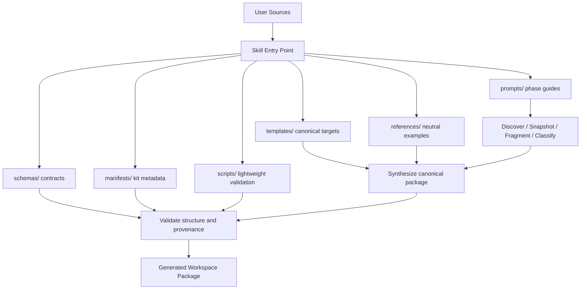
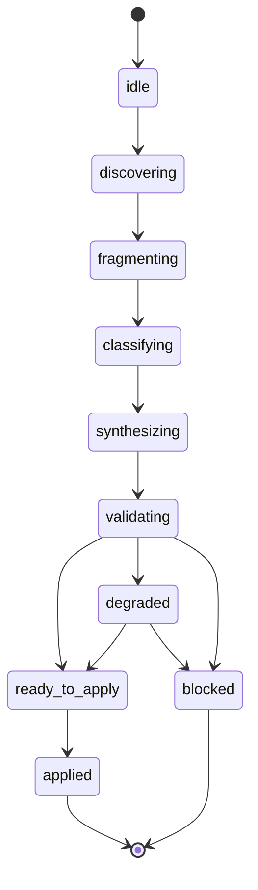

# Design - Hardless Skill Kit

## Overview

O `Hardless Skill Kit` sera desenhado como uma trilha repo-native distribuivel que combina uma skill procedural com um conjunto pequeno e previsivel de artefatos estaticos: templates, references, prompts, schemas, manifests e documentacao. A skill nao carregara o produto inteiro dentro de si; ela funcionara como orquestradora do pipeline, lendo o kit conforme a fase atual e produzindo artefatos estruturados no workspace alvo.

A abordagem geral privilegia modularidade e previsibilidade. Em vez de depender de MCP para ativacao, o kit passa a operar em qualquer runtime de LLM que consiga ler arquivos do repositorio e seguir instrucoes disciplinadas. Isso atende melhor aos requisitos porque reduz superficie tecnica, separa procedimento de conteudo e preserva a capacidade futura de retomar o MCP sem reacoplar as duas trilhas.

Este design cobre a estrutura interna da nova pasta `products/hardless-skill-kit/`, a separacao entre payload público e material de desenvolvimento, a relacao entre skill e ativos estaticos, o contrato operacional de fragmentacao, a estratégia de distribuição e a forma como o kit deve gerar um pacote final canônico. Ele nao cobre plugin de editor, frontend proprio ou implementacao detalhada de tasks além dos slices já fechados.

## Goals

- Definir uma arquitetura repo-native clara para o `Hardless Skill Kit`.
- Separar skill procedural de templates, references, prompts, schemas e manifests.
- Formalizar o pipeline canônico de transformacao do material bruto do usuario.
- Definir um contrato de fragmentacao baseado em papel operacional.
- Garantir neutralizacao de identidade em todo material distribuivel.
- Manter convivencia limpa com `packages/hardless-mcp`.
- Preparar o kit para futura extração em um repositório público de distribuição.
- Preparar uma base suficiente para `tasks.md` sem forcar implementacao prematura.

## Non-Goals

- Implementar frontend, backend cloud ou auth.
- Substituir ou remover o alpha MCP existente.
- Criar plugin/extensao de editor nesta fase.
- Resolver todos os detalhes de automacao do runtime onde a skill sera executada.

## Architecture

O `Hardless Skill Kit` sera mantido em duas camadas:

- `products/hardless-skill-kit/public/`
  - payload distribuível;
  - conteúdo enviado ao repositório público;
  - base para clone, `.zip` e uso real do kit.

- `products/hardless-skill-kit/`
  - raiz de desenvolvimento desta trilha;
  - documentação interna mínima e ponte para a spec.

Dentro de `public/`, o kit distribuível é composto por sete blocos principais, com `SKILL.md` vivendo dentro do próprio payload para reduzir atrito de instalação:

1. `SKILL` ou entrypoint procedural
   - descreve as fases do pipeline;
   - decide o que ler;
   - impõe output minimo e gates.

2. `prompts/`
   - instrucoes especializadas por fase;
   - reduzem o peso do `SKILL.md`;
   - ajudam a manter o procedimento modular.

3. `templates/`
   - estrutura canônica de saida;
   - modelos de `AGENTS.md`, `index`, `rules`, `reference`, `memory` e manifests.

4. `references/`
   - exemplos e baselines neutros;
   - mostram o formato esperado sem expor identidade de projetos reais.

5. `schemas/`
   - contratos de fragmentos, artefatos sintetizados e manifests;
   - restringem a liberdade da LLM onde o produto precisa de consistencia.

6. `manifests/`
   - metadados do proprio kit;
   - versao, compatibilidade, politicas de nomenclatura e convencoes.

7. `scripts/`
   - validação mínima do kit;
   - checks de presença, neutralização e consistência estrutural;
   - suporte leve ao fluxo de distribuição.



## Data Flow

### 1. Inicializacao da execucao

1. O operador aciona a skill no ambiente suportado.
2. A skill identifica o pedido como fluxo de ingestao/fragmentacao do kit.
3. A skill carrega o minimo necessario do proprio kit: prompts da fase atual, templates relevantes e schemas basicos.

### 2. Discovery e snapshot

1. A skill localiza as fontes fornecidas pelo usuario no workspace alvo.
2. A skill registra quais fontes existem, quais estao ausentes e quais sao ambiguas.
3. O resultado dessa fase vira um artefato intermediario de inventario, nao um pacote final.

### 3. Fragmentacao e classificacao

1. A skill quebra as fontes em unidades menores usando delimitadores estruturais e regras do contrato de fragmentacao.
2. Cada unidade recebe um papel operacional candidato, como `rules`, `reference` ou `memory`.
3. A skill explicita conflitos, lacunas e baixa confianca em vez de esconder a ambiguidade.

### 4. Sintese orientada por templates

1. A skill seleciona os templates necessarios conforme o material disponivel.
2. A LLM reorganiza e reescreve os fragmentos dentro da estrutura canônica.
3. A skill evita gerar categorias desnecessarias quando nao houver material suficiente.

### 5. Validacao

1. A skill compara a saida gerada com os schemas e regras de nomenclatura.
2. A skill confirma se `AGENTS.md` ficou centralizador e enxuto.
3. A skill confirma se referencias e exemplos permanecem neutros.
4. Se o pacote falhar na validacao, a skill bloqueia conclusao ou marca degradacao clara.

### 6. Export/apply

1. A skill prepara o pacote final para ser salvo/aplicado no workspace do usuario.
2. O pacote inclui estrutura final, manifests de proveniencia e relatorio de lacunas quando necessario.

## Components And Responsibilities

### `SKILL.md`

- Responsabilidade: coordenar as fases do fluxo e impor disciplina operacional.
- Entradas: pedido do operador, fontes do usuario, artefatos do kit.
- Saidas: instrucoes por fase, gates, output minimo esperado.
- Dependencias: `prompts/`, `templates/`, `schemas/`, `references/`.
- Restricoes: nao deve virar deposito de templates, exemplos longos ou contratos inteiros.
- Observacao de distribuicao: deve permanecer dentro da raiz do kit para que um clone ou `.zip` contenha tudo o que o operador precisa.

### `prompts/`

- Responsabilidade: encapsular instrucoes detalhadas por fase.
- Entradas: fase atual do pipeline.
- Saidas: instrucoes especializadas para discovery, fragmentacao, classificacao, sintese e validacao.
- Dependencias: `schemas/` e `templates/`.
- Restricoes: prompts devem ser curtos o bastante para uso seletivo e nao duplicar a skill inteira.

### `templates/`

- Responsabilidade: definir a estrutura canônica dos artefatos finais.
- Entradas: fragmentos classificados e decisoes da skill.
- Saidas: alvo estrutural para `AGENTS.md`, `agents/index/*`, `agents/rules/*`, `agents/reference/*`, `agents/memory/*` e manifests.
- Dependencias: politica de nomenclatura e contrato de fragmentacao.
- Restricoes: devem usar somente vocabulário neutro e previsivel.

### `references/`

- Responsabilidade: oferecer exemplos neutros de como o pacote final deve parecer.
- Entradas: nenhum input de runtime obrigatorio; serve como material de apoio.
- Saidas: exemplos e baselines para consulta seletiva.
- Dependencias: templates canônicos.
- Restricoes: nao podem expor nomes, dominios ou contratos de projetos reais.

### `schemas/`

- Responsabilidade: restringir e validar a forma dos artefatos.
- Entradas: fragmentos intermediarios e saida final.
- Saidas: contratos verificaveis para fragmentos, artefatos sintetizados e manifests.
- Dependencias: convenções do kit.
- Restricoes: o kit nao deve aceitar saida final sem passar por esses contratos minimos.

### `manifests/`

- Responsabilidade: descrever metadados do kit e da compilacao.
- Entradas: estado do kit e resultado da execucao.
- Saidas: versao, proveniencia, cobertura, conflitos, lacunas.
- Dependencias: `schemas/`.
- Restricoes: devem ser legiveis por maquina e pequenos o bastante para auditoria simples.

### `scripts/`

- Responsabilidade: validar minimamente o kit antes da distribuição.
- Entradas: raiz do kit, manifestos e arquivos distribuíveis.
- Saidas: sucesso ou falha objetiva do pacote.
- Dependencias: `manifests/` e `schemas/`.
- Restricoes: devem permanecer leves, locais e sem dependência de infraestrutura externa.

## Interfaces And Contracts

### Estrutura do kit

```text
products/hardless-skill-kit/
  README.md
  public/
    README.md
    SKILL.md
    prompts/
      discover.md
      fragment.md
      classify.md
      synthesize.md
      validate.md
    templates/
      AGENTS.md.template
      agents/
        index/
        rules/
        reference/
        memory/
    references/
      canonical-structure/
    schemas/
      fragment.schema.json
      artifact.schema.json
      package.schema.json
    scripts/
      validate-skill-kit.mjs
    manifests/
      kit-manifest.json
      naming-policy.json
```

### Estrutura de distribuicao

- `repositorio de desenvolvimento`
  - permanece neste monorepo enquanto o conceito evolui;
  - concentra spec, iteracao e possivel reaproveitamento conceitual com o MCP.
  - usa `products/hardless-skill-kit/public/` como fonte de verdade do payload.

- `repositorio publico de distribuicao`
  - recebera apenas o kit distribuivel;
  - deve ser simples o suficiente para clone direto ou download de `.zip`;
  - deve conter `SKILL.md` e todos os ativos estaticos necessarios para uso.
  - deve poder ser atualizado por um único fluxo de publish automatizado.

### Contrato de fragmento

Cada fragmento precisa carregar pelo menos:

```json
{
  "fragmentId": "string",
  "sourcePath": "string",
  "rawText": "string",
  "operationalRoleCandidate": "index|rules|reference|memory|manifest|unknown",
  "confidence": "number",
  "ambiguity": "low|medium|high"
}
```

### Contrato de artefato sintetizado

Cada artefato final precisa carregar pelo menos:

```json
{
  "artifactType": "AGENTS|index|rules|reference|memory|manifest",
  "outputPath": "string",
  "derivedFrom": ["fragment-id"],
  "validationStatus": "valid|degraded|blocked"
}
```

### Contrato de fragmentacao por papel

- `index`
  - entra quando o trecho define roteamento por tipo de tarefa, ordem de leitura ou gatilhos de contexto.
- `rules`
  - entra quando o trecho define comportamento normativo, obrigatorio ou recorrente.
- `reference`
  - entra quando o trecho serve de apoio, exemplo, tabela, contrato longo ou ilustracao.
- `memory`
  - entra quando o trecho representa preferencia persistente complementar, mas nao regra estrutural.
- `manifest`
  - entra quando o trecho representa metadado de proveniencia, cobertura, conflito ou validacao.

## States And Transitions

### Estado da execucao do kit



### Regras de transicao

- `idle -> discovering`
  - ocorre quando a skill e acionada com um pedido compativel.
- `discovering -> fragmenting`
  - ocorre quando ha inventario minimo de fontes.
- `fragmenting -> classifying`
  - ocorre quando o material ja foi quebrado em unidades operacionais.
- `classifying -> synthesizing`
  - ocorre quando os papeis operacionais ja podem ser inferidos com confianca suficiente.
- `synthesizing -> validating`
  - ocorre quando a estrutura final preliminar foi montada.
- `validating -> degraded`
  - ocorre quando existe saida util, mas com conflito, cobertura parcial ou baixa confianca.
- `validating -> blocked`
  - ocorre quando a estrutura final viola contratos minimos ou depende demais de inferencia fraca.
- `validating -> ready_to_apply`
  - ocorre quando o pacote passa nos contratos minimos do kit.

## Error Handling

- Fontes ausentes
  - devem ser registradas explicitamente, sem gerar preenchimento silencioso.
- Fontes contraditorias
  - devem produzir conflito rastreavel e possivel degradacao.
- Classificacao ambigua
  - deve manter `unknown` ou baixa confianca em vez de forcar categoria.
- Templates insuficientes
  - devem bloquear a conclusao do pacote ou marcar lacuna operacional clara.
- Saida fora do schema
  - deve impedir `ready_to_apply`.
- Vazamento de identidade real
  - deve ser tratado como falha de validacao, nao como simples warning cosmetico.

## Security And Permissions

O design desta fase nao envolve autenticacao nem autorizacao de usuarios finais, mas ainda exige guardrails operacionais:

- nenhum template ou reference distribuivel pode conter dados ou identidade de projetos reais;
- manifests de proveniencia nao devem copiar conteudo sensivel desnecessariamente;
- a skill deve preferir resumir origem e localizacao em vez de replicar documentos inteiros;
- o kit nao deve assumir acesso irrestrito a ambientes externos nem depender de credenciais.

## Observability And Operations

- `kit-manifest.json` deve registrar versao do kit e compatibilidade basica;
- o pacote gerado deve poder registrar coverage, conflitos e lacunas;
- a fase de validacao deve emitir status claro: `valid`, `degraded` ou `blocked`;
- o kit agora possui validacao automatizada leve para distribuição;
- o kit agora possui um fluxo automatizado de publish para o repositório público;
- a trilha nova deve deixar explicito no README e nos docs que o MCP continua separado e nao e dependencia do kit;
- o rollout sera incremental: primeiro estrutura e contratos, depois skill e ativos concretos, depois tasks.

## Impact Analysis

- `products/hardless-skill-kit/`
  - Evidencia: nova raiz criada para a trilha principal.
  - Tipo de impacto: estrutural.
  - Consequencia provável: separa ownership do kit em relacao ao MCP.
  - Acao necessaria: manter sincronizados o README interno de desenvolvimento e o payload em `public/`.

- `products/hardless-skill-kit/public/`
  - Evidencia: payload público agora vive em pasta dedicada.
  - Tipo de impacto: distribuição.
  - Consequencia provável: reduz risco de empurrar artefatos de desenvolvimento para o repositório público.
  - Acao necessaria: manter `public/` como única fonte de verdade do payload distribuível.

- `repositorio publico de distribuicao` (futuro)
  - Evidencia: decisao de distribuicao simples via clone ou zip.
  - Tipo de impacto: produto/distribuicao.
  - Consequencia provável: exige fronteira clara entre material interno de desenvolvimento e material publico distribuivel.
  - Acao necessaria: preparar a arvore do kit para futura extração sem dependencias ocultas deste monorepo.

- `.specs/features/hardless-skill-kit/`
  - Evidencia: nova epic requirements-first criada.
  - Tipo de impacto: governanca/spec.
  - Consequencia provável: a nova trilha passa a evoluir por artefatos separados do MCP.
  - Acao necessaria: manter sincronizacao entre requirements, design, tasks e futuras decisions.

- `packages/hardless-mcp/`
  - Evidencia: trilha antiga permanece no repo.
  - Tipo de impacto: alinhamento de escopo.
  - Consequencia provável: risco de overlap conceitual se ownership nao for mantido claro.
  - Acao necessaria: evitar mover ativos do kit para dentro do pacote MCP.

- `method/`
  - Evidencia: ja existe base metodologica reaproveitavel no repo.
  - Tipo de impacto: reaproveitamento conceitual.
  - Consequencia provável: parte do metodo do MCP pode alimentar prompts, docs e schemas do kit.
  - Acao necessaria: reaproveitar conceitos sem recolar a semantica MCP como centro do produto.

## Alternatives Considered

- Continuar com MCP como trilha principal
  - descartado porque enforcement por tool call continua fraco demais para o objetivo do produto.

- Colocar o novo conceito dentro de `packages/hardless-mcp`
  - descartado porque mistura dois produtos com prioridades diferentes e confunde ownership.

- Concentrar tudo num unico `SKILL.md`
  - descartado porque gera acoplamento alto, manutencao ruim e pouca reutilizacao estrutural.

- Comecar ja com scripts auxiliares obrigatorios
  - descartado nesta fase porque aumenta escopo antes de estabilizar o metodo e os contratos.

## Open Questions

- O pacote final gerado pelo kit deve incluir manifests por default ou permitir modo minimo sem metadados detalhados?
- A validação leve atual deve permanecer local no repositório de desenvolvimento ou também entrar como comando documentado no repositório público de distribuição?

## Validation Strategy

- revisar se o `design.md` cobre todos os requirements numerados;
- validar manualmente se a estrutura proposta separa de fato skill e ativos estaticos;
- validar manualmente se o contrato de fragmentacao elimina geracao livre de arvore por conceito;
- validar manualmente se a neutralizacao de nomenclatura ficou tratada como regra de produto;
- na fase de tasks, prever checks para:
  - estrutura do kit criada;
  - templates canônicos presentes;
  - references neutras;
  - schemas minimos coerentes;
  - skill lendo artefatos auxiliares em vez de duplicar tudo.

## Design Gate

- Status: `APPROVED`
- Alinhado com `requirements.md`? `sim`
- Decisões pendentes: `2`
- Pode seguir para `tasks.md`? `sim`

## Notes

- Este design deliberadamente mantém scripts fora do caminho crítico do V1.
- O design assume que a skill continua sendo a interface principal de uso, mesmo que no futuro exista plugin ou frontend.
- O `SKILL.md` ja fica decidido dentro do proprio kit; antes de `tasks.md`, vale fechar apenas a politica de manifests, o nivel de validacao do V1 e o nome do repositório publico de distribuição.
- O nome do repositório público já está resolvido; a validação leve por script já faz parte do V1.
- O fluxo oficial de distribuição agora precisa passar por `make publish-hardless-skill-kit`.
