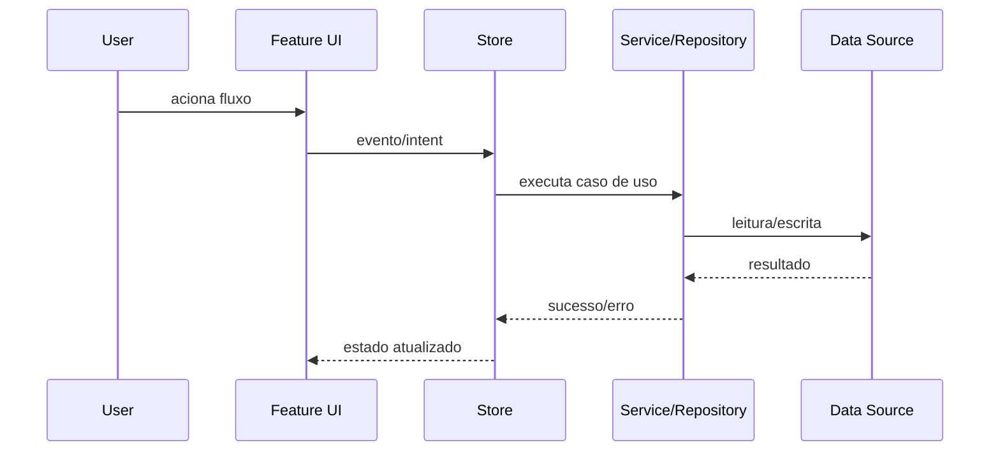
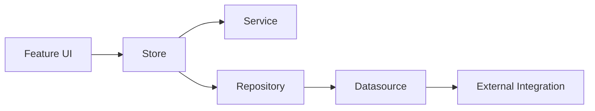

# Feature Research

Documento único para uso como workflow/commands com todo o workflow da skill `feature-research`.

## Objetivo

Criar e manter um dossiê durável de uma feature existente, reduzindo retrabalho futuro de pesquisa e deixando explícitos:

- visão funcional da feature
- mapa técnico de implementação
- decisões e rationale
- impacto no app
- dependências e integrações
- diagramas Mermaid
- riscos e questões abertas
- protocolo de atualização contínua

## Quando usar

Use este workflow quando a tarefa for um deep dive completo de uma feature já existente e houver intenção de registrar o conhecimento de forma reutilizável.

## Saída padrão

Salvar o dossiê em:

`.specs/features/<feature-slug>/research/`

Se o repositório usar outra convenção, adaptar sem duplicar fontes.

Separação recomendada:

- research: `.specs/features/<feature-slug>/research/`
- spec de implementação: `.specs/features/<feature-slug>/spec/`

## Estrutura obrigatória do dossiê

Cada feature deve conter:

1. `README.md` - índice do dossiê
2. `00-summary.md`
3. `01-user-journeys.md`
4. `02-architecture-file-map.md`
5. `03-data-contracts.md`
6. `04-business-rules-permissions.md`
7. `05-dependencies-and-integrations.md`
8. `06-decisions-and-rationale.md`
9. `07-impact-analysis.md`
10. `08-tests-observability-flags.md`
11. `09-risks-open-questions.md`
12. `10-change-log.md`

## Workflow

### 1) Delimitar a feature

Definir:

- nome e slug
- objetivo da feature
- entry points: rotas, telas e actions
- fronteira: o que pertence e o que não pertence

### 2) Explorar a implementação atual

Mapear:

- UI e navegação
- estado, store ou controller
- serviços, repositórios e datasources
- contratos e modelos de dados
- permissões e regras de acesso
- integrações externas
- analytics, observabilidade e testes

### 3) Consolidar evidências

Separar explicitamente:

- fatos confirmados em código
- inferências
- lacunas e perguntas abertas

### 4) Escrever o dossiê completo

Criar ou atualizar todos os arquivos da estrutura obrigatória.

### 5) Validar qualidade

Antes de concluir, verificar:

- consistência entre arquivos
- ausência de contradições
- Mermaid renderizável e fiel ao fluxo
- impacto e dependências explícitos
- decisões com contexto e trade-offs

### 6) Manter atualização contínua

Sempre que a feature mudar no código:

1. atualizar os arquivos do dossiê afetados
2. registrar a mudança em `10-change-log.md`
3. manter decisões e impacto sincronizados

## Regras de qualidade

1. Documentar como a feature é hoje.
2. Evitar redesign especulativo.
3. Manter rastreabilidade para arquivos reais.
4. Registrar incertezas explicitamente.
5. Favorecer estrutura e reuso por futuros agentes.

## Mermaid obrigatório

Em `05-dependencies-and-integrations.md`, incluir no mínimo:

- grafo de dependências da feature
- fluxo principal em `sequenceDiagram` ou `flowchart`

### Padrão de fluxo principal

### Padrão de dependências

## Protocolo de atualização contínua

Gatilhos de atualização:

- alteração de comportamento funcional
- mudança de arquitetura ou componentes
- mudança de contratos de dados
- mudança de regras ou permissões
- nova integração ou remoção de integração
- mudanças relevantes de testes ou observabilidade

Passo a passo:

1. identificar quais arquivos do dossiê foram afetados
2. atualizar conteúdo factual, sem especulação
3. revisar coerência entre seções relacionadas
4. registrar entrada em `10-change-log.md`
5. se a mudança for grande, atualizar também `00-summary.md`

Regra de ouro:

Nenhuma mudança relevante de feature é considerada completa sem atualizar o dossiê.

Checklist rápido:

- [ ] seções impactadas atualizadas
- [ ] Mermaid ajustado, se fluxo ou dependência mudou
- [ ] análise de impacto revisada
- [ ] decisões e rationale revisados
- [ ] change log atualizado

## Estrutura de cada arquivo

### `README.md`

- nome da feature
- slug
- status
- última atualização
- escopo
- índice interno do dossiê

### `00-summary.md`

- propósito da feature
- problema que resolve
- usuários ou atores
- entradas e saídas principais
- limites da feature

### `01-user-journeys.md`

- jornada principal
- jornadas alternativas
- cenários de erro
- exceções e edge cases

### `02-architecture-file-map.md`

- componentes por camada
- fluxo entre camadas
- arquivos-chave e papel de cada um
- pontos de extensão

### `03-data-contracts.md`

- modelos de domínio
- DTOs e adapters
- contratos de API ou Firestore
- validações e constraints
- migrações ou versionamento, se houver

### `04-business-rules-permissions.md`

- regras funcionais
- regras de autorização e ownership
- regras por perfil ou role
- invariantes de negócio

### `05-dependencies-and-integrations.md`

- dependências internas
- dependências externas
- pontos de integração
- fluxo principal em Mermaid
- grafo de dependências em Mermaid

### `06-decisions-and-rationale.md`

- decisões ativas
- contexto
- alternativas consideradas
- trade-offs
- impacto
- decisões rejeitadas
- decisões pendentes

### `07-impact-analysis.md`

- superfícies impactadas
- impacto em outras features
- impacto em dados
- impacto em UX
- impacto operacional, monitoramento e suporte

### `08-tests-observability-flags.md`

- cobertura atual de testes
- lacunas de teste
- logs e métricas
- alertas ou SLOs, se houver
- feature flags e configuração

### `09-risks-open-questions.md`

- riscos técnicos
- acoplamentos críticos
- dívida técnica relacionada
- perguntas abertas

### `10-change-log.md`

- data
- tipo de mudança
- o que mudou
- arquivos do código impactados
- arquivos do dossiê atualizados
- responsável

## Ferramentas recomendadas

- descoberta de arquivos: `Glob`
- busca textual: `rg`
- exploração semântica: `SemanticSearch`
- leitura: `ReadFile`
- escrita e edição: `ApplyPatch`
- exploração ampla: `Subagent`

## Entrega esperada ao usuário

Ao finalizar, entregar:

1. caminho do dossiê criado ou atualizado
2. resumo do que foi mapeado
3. principais riscos e lacunas
4. próximos pontos de manutenção documental

## Observações operacionais

- Documentar a feature como ela é hoje.
- Não inventar comportamento futuro.
- Registrar incertezas explicitamente.
- Manter rastreabilidade para código real.
- Preferir uma estrutura reutilizável para agentes futuros.
